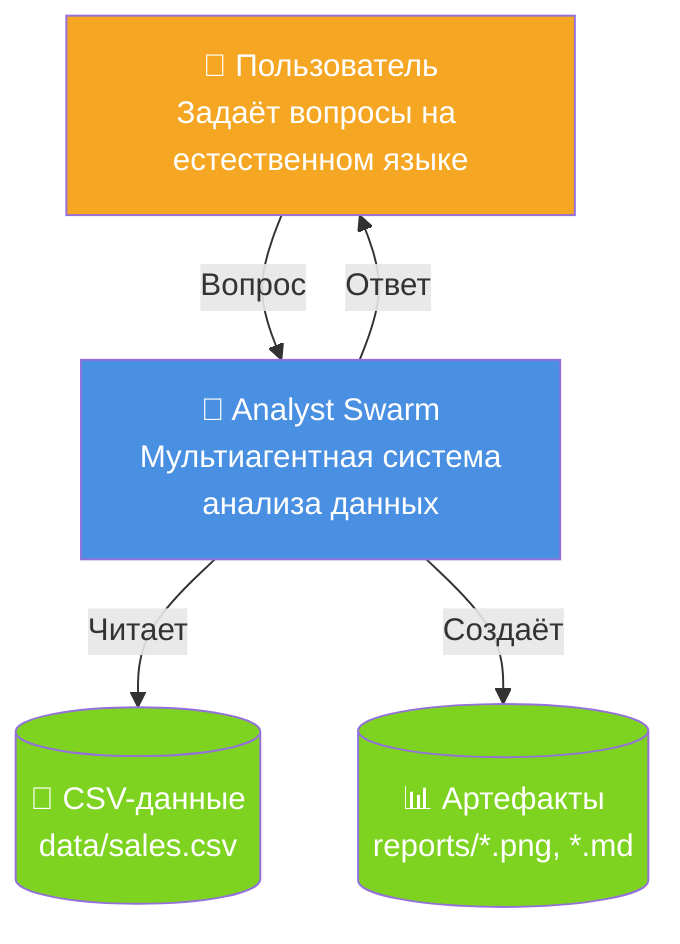
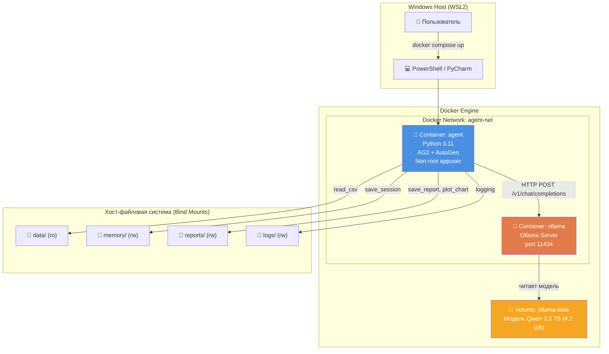
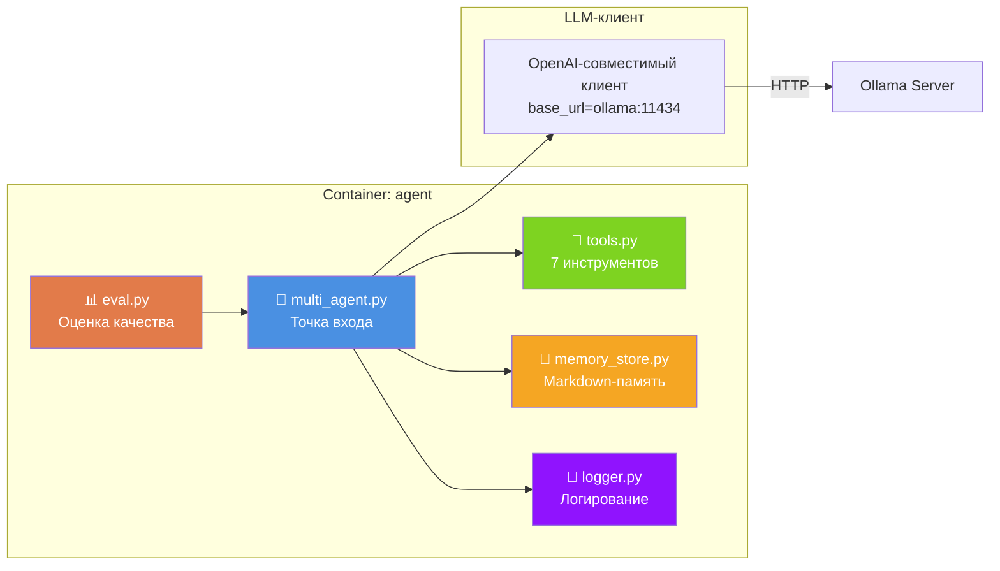
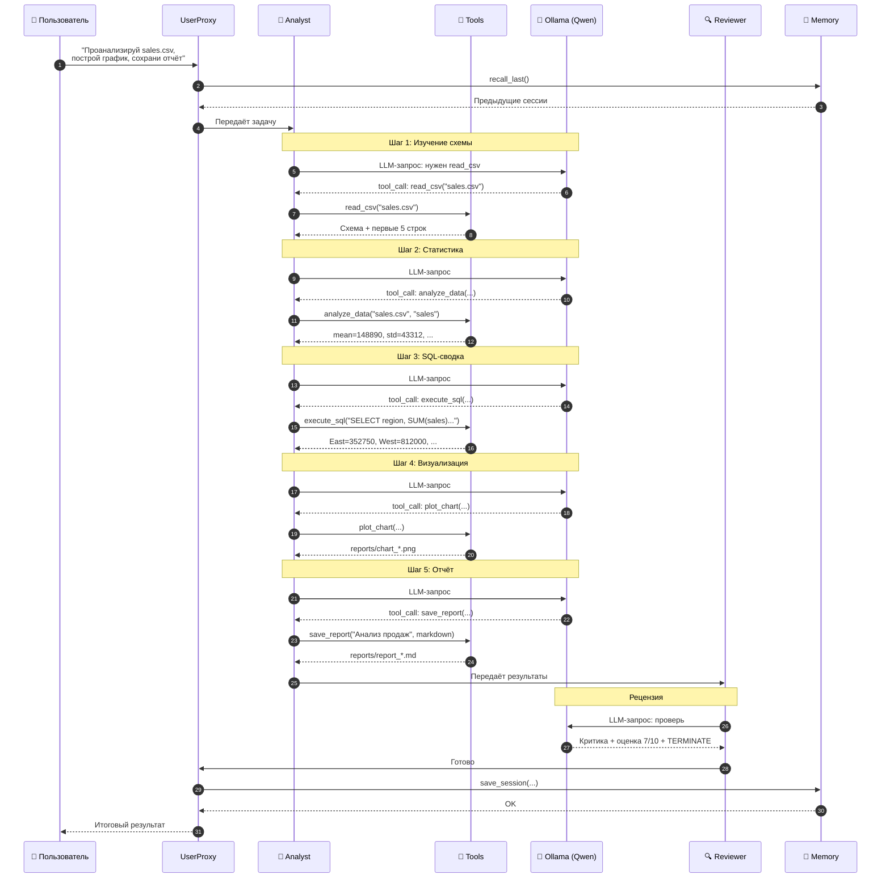
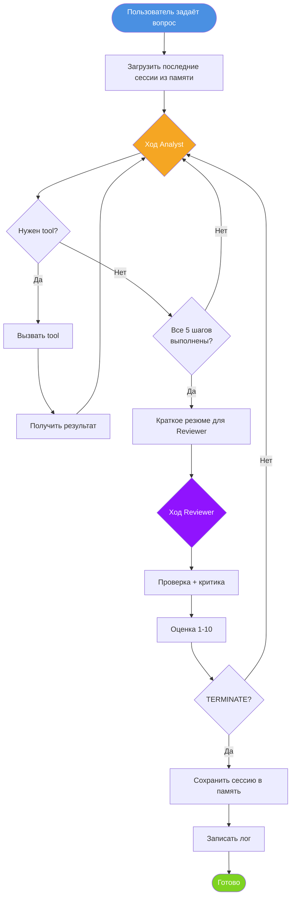
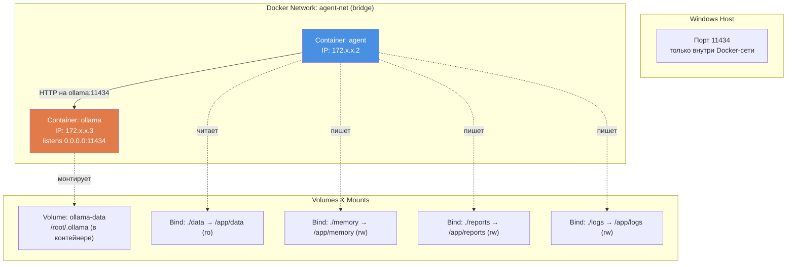

# Архитектура Analyst Swarm

## C4 — Context Diagram (уровень 1)

Показывает систему в контексте пользователя и внешних сущностей.

## C4 — Container Diagram (уровень 2)

Показывает контейнеры (Docker), из которых состоит система.

## C4 — Component Diagram (уровень 3)

Показывает модули внутри контейнера `agent`.

---

## Sequence Diagram — Типичный сценарий

Показывает полный поток выполнения задачи «Проанализируй sales.csv».

---

## Flow Diagram — Алгоритм работы группы

---

## Инфраструктурная схема — Сеть и Volumes

---

## Обоснование архитектурных решений

### Почему GroupChat, а не обычный pipeline?

**GroupChat** с `round_robin` даёт **детерминированный** порядок агентов: Analyst → Reviewer → Analyst → Reviewer. Это **предсказуемо** для отладки и не требует LLM-роутера.

Альтернативы:
- **Sequential pipeline** (Analyst → Reviewer фиксировано) — проще, но не даёт Analyst'у ответить на критику.
- **Auto speaker selection** (LLM выбирает, кто говорит) — гибче, но 7B-модель часто ошибается.
- **Hierarchical** (manager + workers) — избыточно для 2 агентов.

### Почему 2 агента, а не больше?

Для задачи анализа данных достаточно:
- **Analyst** — делает работу
- **Reviewer** — критикует и оценивает

Добавление третьего агента (Writer, Critic, Judge) увеличивает контекст и время, но не улучшает результат на 7B-модели.

### Почему Ollama в том же compose?

Из-за WSL2 + Docker Desktop: `host.docker.internal` не пробрасывается. Ollama в одной сети с агентом — надёжное решение.