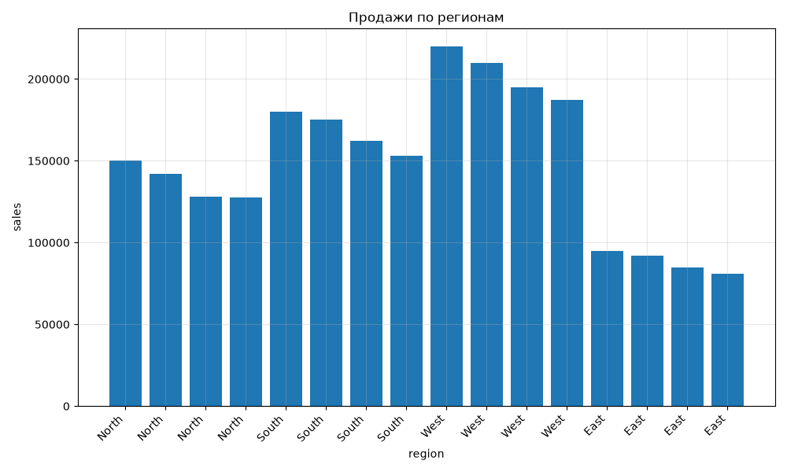

# Анализ продаж

_Создано: 2026-10-03 13:55:06_

# Анализ продаж

## Статистика

Количество записей: 16
Среднее значение продаж: 148890.62
Медиана продаж: 151500.00
Минимальное значение продаж: 80750.00
Максимальное значение продаж: 220000.00
Среднее отклонение продаж: 43312.90

## Сводка по регионам

| Регион | Общая сумма продаж |
| --- | --- |
| Восток | 352750 |
| Север | 547500 |
| Юг | 670000 |
| Запад | 812000 |

